  

 

### Featured Production Systems

<table>
  <tr>
    <td width="50%" valign="top">
      <h4><a href="https://github.com/omshukladev/chatty">Chatty</a></h4>
      
End-to-end encrypted real-time messaging system featuring sub-200ms message delivery, typing indicators, presence tracking, and read receipts.

      
<code>Socket.IO</code> <code>AES-256</code> <code>MongoDB</code> <code>React</code> <code>Express</code>

      
<a href="https://chatty-a6ys.onrender.com">Live Deployment &rarr;</a>

    </td>
    <td width="50%" valign="top">
      <h4><a href="https://github.com/omshukladev/costpilot">CostPilot</a></h4>
      
Automated AI subscription auditor analyzing organizational SaaS spend across 8 AI platforms with deterministic logic and Gemini-powered briefing exports.

      
<code>Hono</code> <code>Cloudflare D1</code> <code>Gemini API</code> <code>Three.js</code> <code>React</code>

      
<a href="https://costpilot-costpilot-web.vercel.app/">Live Deployment &rarr;</a>

    </td>
  </tr>
  <tr>
    <td width="50%" valign="top">
      <h4><a href="https://github.com/omshukladev/talent-Iq">Talent-IQ</a></h4>
      
Collaborative coding interview platform with live video communication, embedded Monaco code editor, sandboxed code execution, and Prometheus metrics.

      
<code>Stream SDK</code> <code>Piston API</code> <code>Prometheus</code> <code>Clerk</code> <code>MongoDB</code>

      
<a href="https://talent-iq-eg56.onrender.com">Live Deployment &rarr;</a>

    </td>
    <td width="50%" valign="top">
      <h4><a href="https://github.com/omshukladev/metric-flow">MetricFlow</a></h4>
      
Edge-first developer productivity suite with Web Audio focus timer, 369+ curated DSA practice problems, and 3D global network visualization.

      
<code>Cloudflare Workers</code> <code>D1/R2</code> <code>Globe.gl</code> <code>Monaco Editor</code>

      
<a href="https://github.com/omshukladev/metric-flow">Source Repository &rarr;</a>

    </td>
  </tr>
  <tr>
    <td width="50%" valign="top">
      <h4><a href="https://github.com/omshukladev/free-pdf-edit">PDF ToolKit</a></h4>
      
100% browser-based visual PDF workspace with optical character recognition (OCR), vector drawing, shape manipulation, and zero-server document privacy.

      
<code>Astro</code> <code>Fabric.js</code> <code>PDF.js</code> <code>Tesseract.js</code>

      
<a href="https://onlineeditpdf.com">Live Deployment &rarr;</a>

    </td>
    <td width="50%" valign="top">
      <h4><a href="https://github.com/omshukladev/ether-scope-v2">EtherScope</a></h4>
      
Cross-platform mobile Ethereum portfolio tracker with live transaction streaming, background push alerts, and multi-wallet balance aggregation.

      
<code>React Native</code> <code>Expo</code> <code>Cloudflare Workers</code> <code>Etherscan API</code>

      
<a href="https://github.com/omshukladev/ether-scope-v2">Source Repository &rarr;</a>

    </td>
  </tr>
</table>

<b>Additional Engineered Systems</b>

 

| System | Architecture &amp; Function | Repository / Demo |
| :--- | :--- | :--- |
| **EdgeGuard** | Anti-cheat tournament monitoring extension with Cloudflare Workers backend and randomized R2 screenshot capture | [Repository](https://github.com/omshukladev/edgeguard) |
| **Cloudinary SaaS** | Media asset management platform with automated social media aspect-ratio transformations | [Repository](https://github.com/omshukladev/saas-cloudinary) &middot; [Live](https://omshukladev-saas-cloudinary.vercel.app/) |
| **TinyURL** | High-throughput URL shortening service with QR code generation and Redis rate limiting | [Repository](https://github.com/omshukladev/tiny-url) &middot; [Live](https://tiny-url-xr7b.onrender.com) |
| **Sonic Runner** | High-frame-rate endless runner browser game built on the Kaplay gaming engine | [Repository](https://github.com/omshukladev/sonic-ring-runner) &middot; [Live](https://sonic-ringrunner.netlify.app/) |

 

---

  
  &nbsp;
  
  &nbsp;
  
  &nbsp;
  

 

  Building systems that scale, sync, and survive.

